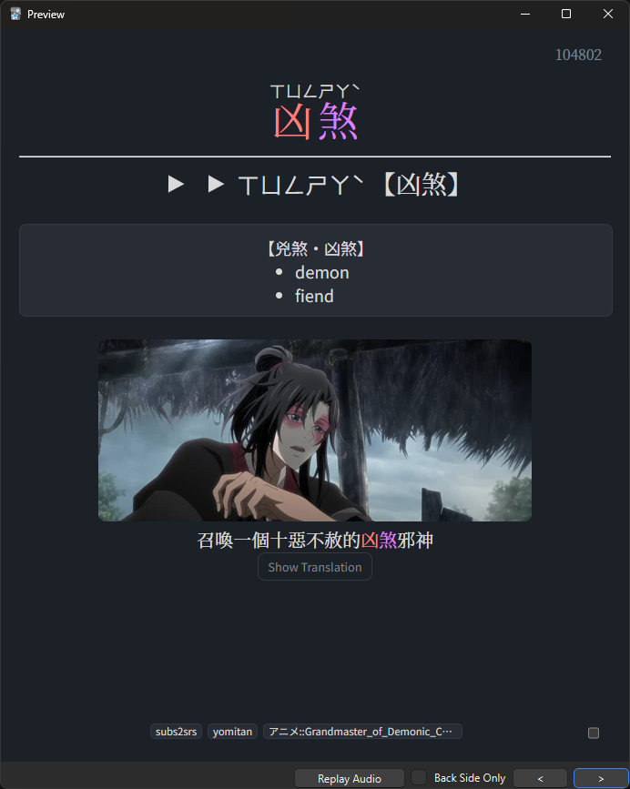
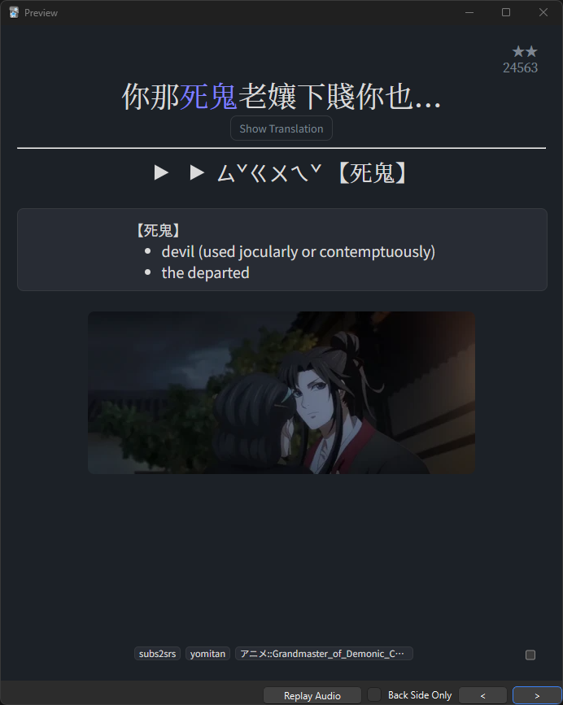
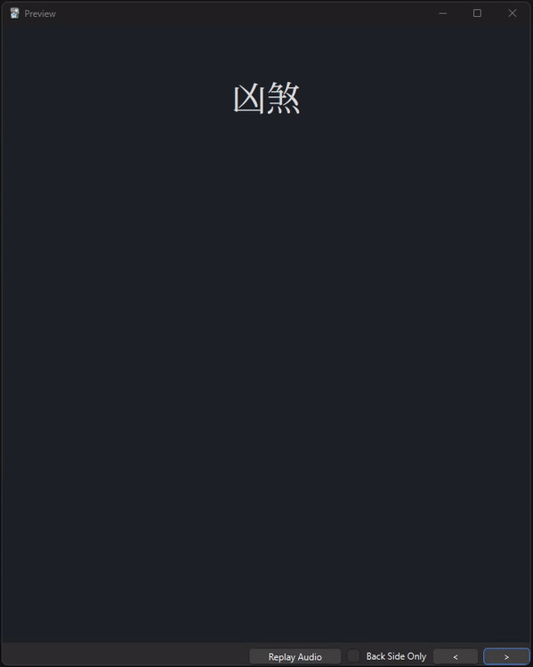
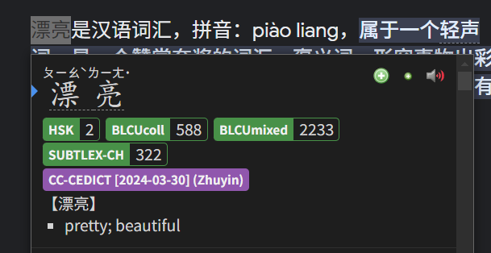

# ZH-study

- [Anki Mining Template](#anki-mining-template)
- [Traditional HSK Deck](#traditional-hsk-deck)
- [Zhuyin Yomitan Dictionaries](#zhuyin-yomitan-dictionaries)

## Anki Mining Template

Anki Mining card template for Chinese.

[Download](https://github.com/rudnam/ZH-study/raw/main/Mining_temp.apkg)

<p align="center">
    
    
    
</p>

### Yomichan fields

| Field              | Value                                             |
| ------------------ | ------------------------------------------------- |
| Expression         | `{expression}`                                    |
| ExpressionFurigana | `{furigana-plain}`                                |
| ExpressionReading  | `{reading}`                                       |
| ExpressionAudio    | `{audio}`                                         |
| MainDefinition     | `{selection-text}`                                |
| Sentence           | `{cloze-prefix}<b>{cloze-body}</b>{cloze-suffix}` |
| SentenceFurigana   |                                                   |
| SentenceAudio      |                                                   |
| Hint               |                                                   |
| FullDefinition     | `{glossary}`                                      |
| Image              |                                                   |
| Translation        |                                                   |
| Frequency          | `{frequencies}`                                   |
| FreqSort           |                                                   |
| MiscInfo           | `{document-title}`                                |
| ExtraField         |                                                   |
| \*IsSentenceCard   |                                                   |

Notes:

- When the **\*IsSentenceCard** field is filled with any character, card is turned into a sentence card. When empty, it is turned into a vocab card.
- The **MainDefinition** field is for the displayed definition on the card. When empty, the template displays a definition from the **FullDefinition** field. The preferred dictionaries for the default definition can be changed in the [back template](https://github.com/rudnam/ZH-study/blob/main/2_Mining_Back.html#L601-L606).
- The **FreqSort** field is for frequency sorting. (See [freq](https://github.com/MarvNC/JP-Resources#sorting-mined-anki-cards-by-frequency)).
- The **Hint** field is for a hint on the front of the card (See [Animecards](https://animecards.site/ankicards/#the-hint-field)).
- The furigana fields only take in plain furigana. (e.g. 汉字[hànzì] not <ruby>汉字<rt>hànzì</rt></ruby>).
- The automatic tone coloring _should_ work for Zhuyin and Pinyin.
- The character set (default is Traditional Chinese) can be changed in the [back template](https://github.com/rudnam/ZH-study/blob/main/2_Mining_Back.html#L593).

### Other applications

More info can be added using other applications.

- For [mpvacious](https://github.com/Ajatt-Tools/mpvacious), fields can be filled like the following. In `subs2srs.conf`:

  ```
  model_name=Mining-ZH

  sentence_field=Sentence
  secondary_field=Translation
  audio_field=SentenceAudio
  image_field=Image
  miscinfo_field=MiscInfo

  # The tag(s) added to new notes. Spaces separate multiple tags.
  note_tag=subs2srs 动画::%n
  ```

- For [jidoujisho](https://github.com/lrorpilla/jidoujisho), fields can be filled like the following:

  | Field              | Value          |
  | ------------------ | -------------- |
  | Expression         | Term           |
  | ExpressionFurigana | Furigana       |
  | ExpressionReading  | Reading        |
  | ExpressionAudio    | Term Audio     |
  | Sentence           | Sentence       |
  | SentenceAudio      | Sentence Audio |
  | FullDefinition     | Meaning        |
  | Image              | Image          |
  | FreqSort           | Frequency      |
  | MiscInfo           | Context        |

  - [x] Include image/audio HTML tags on export
  - [x] Use line break tag instead of newline on export
  - [x] Prepend dictionary name in meaning

## Traditional HSK Deck

Traditional version for the [HSK Deck](https://www.reddit.com/r/ChineseLanguage/comments/7mjmjc/best_anki_deck_for_hsk_ive_come_across/).

Changes:

- Displays Traditional instead of Simplified
- Added tone coloring
- Uses Zhuyin instead of Pinyin
- Slightly modified layout

[Download Link](https://drive.google.com/file/d/1SpR2q5mZ1KW5Oo-kTHgVZ4g1vfL9xVbM/view?usp=sharing)

<p align="center">
    
</p>

## Zhuyin Yomitan Dictionaries

Yomitan dictionaries from [MarvNC](https://github.com/MarvNC/yomichan-dictionaries?tab=readme-ov-file#mandarin-chinese) with readings in Zhuyin instead of Pinyin. Made using this [script](https://github.com/rudnam/convert-dict-to-zhuyin).

[GDrive Folder](https://drive.google.com/drive/folders/17sRcoVs_M3-RFBxyxSfV2HGqFv5bWFqU?usp=sharing)

<p align="center">
    
</p>
