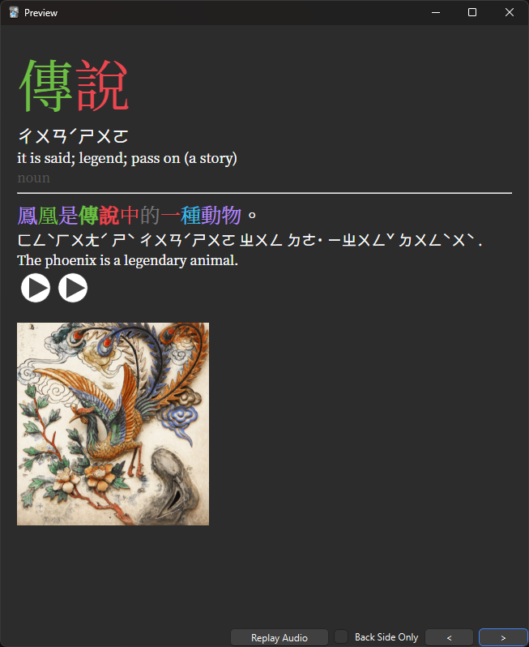

# ZH-study

- [Traditional HSK Deck](#traditional-hsk-deck)

## Traditional HSK Deck

Traditional version for the [HSK Deck](https://www.reddit.com/r/ChineseLanguage/comments/7mjmjc/best_anki_deck_for_hsk_ive_come_across/).

Changes:

- Displays Traditional instead of Simplified
- Added tone coloring
- Uses zhuyin instead of pinyin (Generated using [Chinese Support 3](https://ankiweb.net/shared/info/1752008591))
- Slightly modified layout

[Download Link](https://drive.google.com/file/d/1SpR2q5mZ1KW5Oo-kTHgVZ4g1vfL9xVbM/view?usp=sharing)

    

