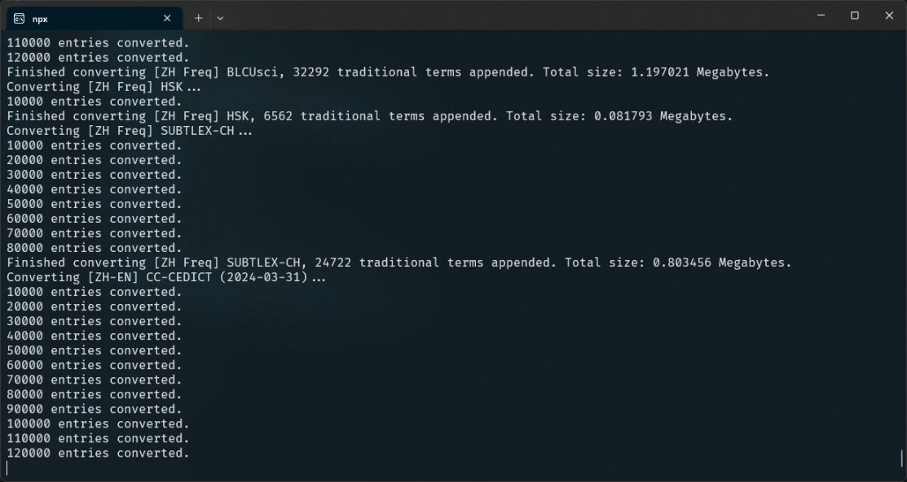

# add-tw-support

Script to convert Pinyin readings to Zhuyin and add entries for Traditional terms in Yomitan dictionaries



## Instructions

1. Clone this repository

   ```shell
   git clone https://github.com/rudnam/ZH-study.git
   cd ./scripts/add-tw-support
   ```

2. Paste the dictionaries to convert (.zip) into the `dicts` folder.

3. Install dependencies and run script

   ```shell
   npm install
   npx ts-node add-tw-support.ts
   ```

## Options

You can toggle pinyin-zhuyin conversion and adding entries for traditional terms by specifying like so:

```shell
npx ts-node add-tw-support.ts --no-zhuyin # Don't convert to Zhuyin
npx ts-node add-tw-support.ts --no-trad   # Don't append traditional entries
```
